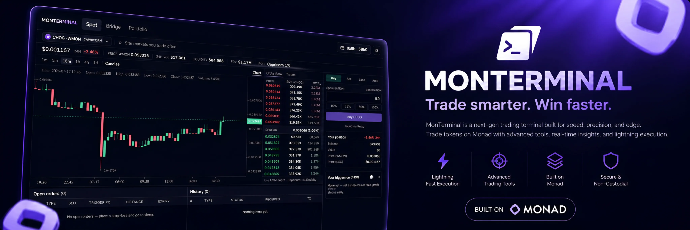
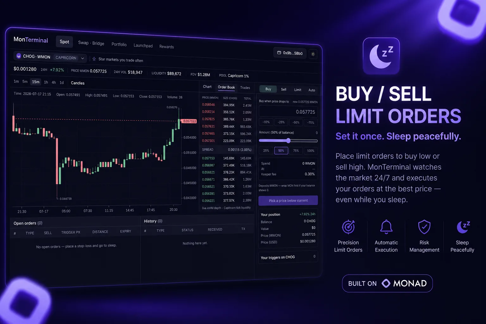
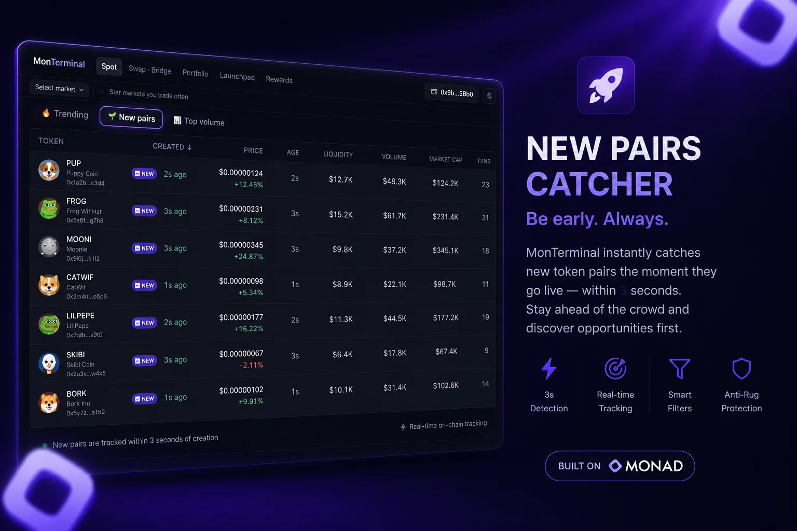
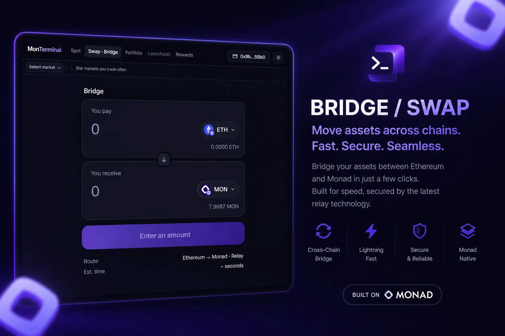
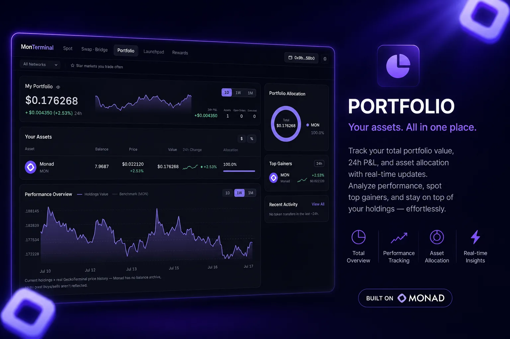

# MonTerminal

**[monterminal.fun](https://www.monterminal.fun/)** — non-custodial stop-losses, take-profits and sell ladders on Monad mainnet.

You buy a meme coin and want to sleep. MonTerminal gives you GMGN-style automation, fully on-chain: *"sell everything if I'm down 50%"*, *"at 2× sell half, let the rest ride"* — with no deposits, no custody, and permissionless execution. Around it: a full trading terminal (live charts, order book depth, instant buys), an any-to-any swap + bridge over 59 chains, and a live portfolio.

Built for the buildanything.so **Spark** Monad hackathon. 100% original code.

## Features



### Buy / Sell limit orders — set it once, sleep peacefully

The heart of MonTerminal: on-chain take-profits, stop-losses and buy-the-dip limits with **no custody** — tokens stay in your wallet until the trigger fires. Pick a price (or tap a ±% chip), slide the amount, place. Sell orders auto-detect stop-loss vs take-profit from where your price sits vs market. The **AI tab** accepts plans such as *"sell 20% at $0.0003, 30% at $0.0004, and buy 10% if it drops 50%"*, converts them into schema-validated buy/sell intents, and shows the exact on-chain triggers before the wallet signs one atomic `placeOrders` transaction. The model can draft but cannot access the wallet, calculate calldata, or execute anything; deterministic code owns price/tick conversion, allocation checks, approvals and contract parameters. Execution is permissionless — the keeper bot, MEV searchers, or anyone else fills triggered orders and earns the maker-set fee, so orders execute 24/7 even while you sleep.



### New pairs catcher — be early, always

The GMGN-style discovery home streams every Monad DEX: 🔥 Trending, 🌱 New pairs and 📊 Top volume, dense with age, price moves (5m/1h/24h), volume, liquidity, market cap and transaction counts. Fresh pools surface the moment indexers see them, icons resolve straight from the launchpad's on-chain metadata before any aggregator has them, and tab switches paint in ~100ms from the warmed cache. One click on any row opens the full terminal — chart, order book depth, trades and the trade panel.



### Swap · Bridge — move assets across chains, fast

One widget for both: same chain on both sides is a swap, different chains bridge — with a destination-side swap folded in, so "MON → a memecoin on another chain" is one transaction. **59 EVM chains**, any-to-any tokens, quoted and filled through Relay's quote/v2 with the full status lifecycle (deposit → fill → destination tx hash), stale-quote auto-refresh, gas-aware Max, and honest fee rows (Provider fee, Swap impact, Min. received). Paste any contract address to find tokens the curated lists don't carry.



### Portfolio — your assets, all in one place

Live total value, 24h P&L and per-asset allocation read straight from the chain — balances via multicall, prices joined from DexScreener and GeckoTerminal, **no balance archive faked**: the performance chart is current holdings × real price history, benchmarked against MON, with 1D/1W/1M ranges, sparklines per asset, top gainers and recent on-chain activity. Charts paint instantly from a shared cache (localStorage → Supabase) that every visitor warms for everyone else.

## How it works

```
┌──────────┐  approve + placeOrders   ┌──────────────────┐
│  Trader   │ ───────────────────────▶ │  LimitOrderBook   │  immutable, no owner
│ (web UI)  │        cancel ▲          │   (on-chain)      │  no escrow — tokens stay
└──────────┘                          └────────┬─────────┘  in your wallet
                                                │ executeOrder (anyone)
                              ┌─────────────────┼─────────────────┐
                              ▼                 ▼                 ▼
                         keeper bot       MEV searchers      you, manually
                              └── caller earns the keeper fee ────┘
                                                │
                                     Uniswap v3 exactInputSingle
                                     proceeds → maker (native MON)
```

Three pieces, one pnpm monorepo:

| Package | What |
|---|---|
| [`contracts/`](contracts/) | Foundry — `LimitOrderBook.sol` + `ForkRouter.sol` + mainnet-fork test suite (33 tests) |
| [`keeper/`](keeper/) | Node 22 + viem bot — polls every 1s, simulates, executes when profitable |
| [`web/`](web/) | Vite + React 19 + Tailwind v4 dark trading terminal (chart, ladders, order dock) |
| [`packages/shared/`](packages/shared/) | Chain def, addresses, ABI, tick/price math — unit-tested, used by web **and** keeper |

## Security design: how triggers are proven

The interesting problem: how does an on-chain order book know the price crossed your trigger, without a trusted oracle, and without being manipulable?

**Take-profit — the market is the proof.** `minAmountOut` *is* the trigger. The swap simply reverts unless the pool pays at least your target quote. There is no price read at all — manipulation (pump/sandwich) can only *improve* your fill, never hurt it.

**Stop-loss — 60s TWAP, two ways.**
1. *Firing*: the contract reads the pool's 60-second TWAP tick via `observe()` and requires it past your trigger. A flash-loan dump moves spot, not the TWAP — the order won't fire inside the same block (fork-tested).
2. *Filling*: at execution the contract computes a **dynamic floor** — `quoteAtTick(twapTick) × (1 − maxSlippageBps)` — and swaps with `amountOutMinimum = max(dynamicFloor, order.minAmountOut)`. A keeper (or searcher) sandwiching your exit gets the whole tx reverted.

`placeOrders` calls `increaseObservationCardinalityNext(180)` on stop-loss pools so the TWAP window is always available; a fresh pool reverts `TwapUnavailable()` and the keeper backs off and retries.

**Ladders** ("sell 50% at 2×, 25% at 5×") are N independent orders placed atomically in one `placeOrders([...])` tx — O(1) execution each, individually cancellable, no partial-fill accounting.

Other properties:
- **Immutable** — no owner, no pause, no upgrade path.
- **Approval-based custody** — tokens are pulled only at the moment your trigger fires; the book holds zero balance between transactions (fuzz + invariant tested).
- **Permissionless execution** — anyone may call `executeOrder` and earn the keeper fee (10–100 bps, default 30). MEV searchers are free backup keepers.
- Reentrancy-guarded, CEI, balance-delta accounting (fee-on-transfer safe), native-MON payout with non-griefable WMON fallback.

**Multi-DEX.** Monad meme coins pool wherever liquidity landed — Uniswap v3, Capricorn, PancakeSwap v3. The v3 forks share pool bytecode but not init-code hashes, so the canonical periphery can't route them. `ForkRouter` (~100 lines) asks the fork's own factory via `getPool` and settles the swap callback selector-agnostically (authenticity is proven by `msg.sender == factory.getPool(...)`, never by the callback name — Capricorn renamed theirs to an unrecognizable selector). One `LimitOrderBook` deployment per DEX, same bytecode; the UI and keeper pick the book from the pool's market automatically.

## Addresses (Monad mainnet, chainId 143)

All Sourcify-verified.

| Contract | Address |
|---|---|
| LimitOrderBook (Uniswap v3) | [`0x595368DffF28eC08718Ca620EC9a981772628425`](https://monadscan.com/address/0x595368DffF28eC08718Ca620EC9a981772628425) (deploy block 88077155) |
| LimitOrderBook (Capricorn) | [`0x07E94F44c89b648a36c7cd5408b52D76880857f7`](https://monadscan.com/address/0x07E94F44c89b648a36c7cd5408b52D76880857f7) (deploy block 88086521) |
| ForkRouter (Capricorn) | `0xd950EeB0063Ddc186b314113b199C1A675930686` |
| LimitOrderBook (PancakeSwap v3) | [`0x1672DB600D0c0213b3971F30438482Ea2Afaf53F`](https://monadscan.com/address/0x1672DB600D0c0213b3971F30438482Ea2Afaf53F) (deploy block 88086528) |
| ForkRouter (PancakeSwap v3) | `0x46dEc159b5B126f458f16c41E900137d6cAe3F24` |
| WMON | `0x3bd359C1119dA7Da1D913D1C4D2B7c461115433A` |
| Uniswap v3 Factory | `0x204FAca1764B154221e35c0d20aBb3c525710498` |
| Capricorn Factory | `0x6B5F564339DbAD6b780249827f2198a841FEB7F3` |
| PancakeSwap v3 Factory | `0x0BFbCF9fa4f9C56B0F40a671Ad40E0805A091865` |
| SwapRouter02 | `0xfE31F71C1b106EAc32F1A19239c9a9A72ddfb900` |

## Running it

```sh
pnpm install

# contracts — fork tests against pinned Monad mainnet block
cd contracts && MONAD_RPC_URL=https://rpc.monad.xyz forge test

# shared math + keeper evaluator unit tests
pnpm test

# keeper (reads ../.env: RPC_URLS, PRIVATE_KEY, BOOK_ADDRESS, DEPLOY_BLOCK, DRY_RUN)
pnpm keeper

# web terminal
pnpm web
```

`.env` is never committed — see `.env.example`.

The browser sends Monad JSON-RPC through the project-owned `POST /api/rpc` gateway. Set `RPC_URLS` to a comma-separated list of HTTPS endpoints; the gateway validates JSON-RPC calls, caps batch/body size, and fails over to the next upstream when one is unavailable. `MONAD_RPC_URL` remains the single-endpoint fallback for Forge and deployments.

Pasting any Monad contract first checks bytecode and reads ERC-20 metadata through that gateway. Every valid ERC-20 opens a contract page. Trading controls only unlock when an actual pool exists on a supported factory—MonTerminal never fabricates liquidity, prices, or an executable route.

### Deploy

```sh
cd contracts
forge script script/Deploy.s.sol --rpc-url monad --broadcast --private-key $PRIVATE_KEY
node ../scripts/sync-abi.mjs   # refresh shared ABI after any contract change
```

## Data sources (all real, no mocks)

- **Candles** — GeckoTerminal public API (`networks/monad` OHLCV), 15s refresh, cached localStorage → shared Supabase
- **Live price** — on-chain `slot0` every 3s (the same source the contract's TWAP derives from)
- **Orders** — contract events + `getOrders` multicall; no external indexer
- **Pairs / prices / icons** — DexScreener (CORS-friendly, generous limits), GeckoTerminal behind it
- **Portfolio charts** — project-owned `/api/portfolio-history` batch gateway; real GeckoTerminal OHLCV is fetched in parallel once, shared by both charts and every asset sparkline, then cached locally
- **Swap / bridge / instant buys** — [Relay](https://relay.link) (same-chain swaps, cross-chain bridging from 59 chains, quote/v2 + status lifecycle)
